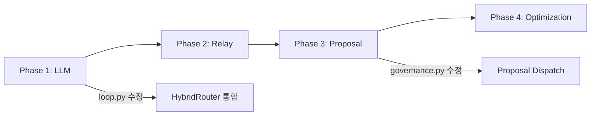

# ODA v3.0 실행 계획서

> **생성일**: 2025-12-17
> **작성**: Claude Opus 4.5 (Full Self-Awareness Mode)
> **목표**: Orion ODA v2.0 → v3.0 하이브리드 아키텍처 마이그레이션

---

## 1. 현재 상태 (AS-IS) 분석 결과

### 1.1 기존 코드베이스 구조

```
scripts/
├── governance.py          # ActionDispatcher, OrionAction (Tier 1)
├── loop.py                # 실행 루프 (Tier 1/2 라우팅)
├── action_registry.py     # Tier 2 Function 레지스트리
├── observer.py            # EventBus
├── ontology/
│   ├── core.py           # OrionObject, ObjectManager
│   ├── plan.py           # Plan 스키마
│   ├── job.py            # Job 스키마
│   ├── handoff.py        # 릴레이 핸드오프
│   └── schemas/          # Pydantic 스키마
├── memory/
│   └── manager.py        # FTS5 메모리 (벡터 미완성)
└── simulation/
    └── core.py           # SAVEPOINT 샌드박스
```

### 1.2 기존 의존성 (pyproject.toml)

```toml
dependencies = [
    "pydantic>=2.0",
    "sqlalchemy>=2.0",
    "uuid6"
]
```

### 1.3 통합 포인트

| 파일 | 통합 방식 | 변경 범위 |
|------|----------|----------|
| `governance.py` | Proposal 통합 (dispatch_from_proposal) | 메서드 추가 |
| `loop.py` | HybridRouter 통합 | run_loop 수정 |
| `ontology/handoff.py` | RelayQueue 연결 | 릴레이 자동화 |

---

## 2. 구현 Phase 순서

### Phase 1: 로컬 LLM 기반 (P0 - 최우선)

**목표**: 60-70% 작업을 Ollama로 자동화

**신규 파일**:
```
scripts/llm/
├── __init__.py
├── ollama_client.py    # Ollama HTTP 클라이언트
├── router.py           # HybridRouter (라우팅 결정)
├── models.py           # Pydantic 출력 스키마
└── prompts/
    ├── json_validation.txt
    └── schema_check.txt
```

**핵심 클래스**:
1. `OllamaClient` - Pydantic 네이티브 구조화 출력
2. `HybridRouter` - LOCAL_TASKS vs HUMAN_RELAY 결정
3. `RouteTarget` - Enum (OLLAMA, HUMAN_RELAY)

**의존성 추가**:
```toml
"httpx>=0.27.0"  # 기본 의존성
[optional] "ollama>=0.4.0"  # 선택적
```

---

### Phase 2: 릴레이 프로토콜 코어 (P0 - 최우선)

**목표**: 클립보드 자동화 + 데스크톱 알림

**신규 파일**:
```
scripts/relay/
├── __init__.py
├── clipboard.py        # pyperclip 래퍼
├── notification.py     # Windows Toast / Linux notify-send
├── queue.py           # SQLite 기반 작업 큐
└── executor.py        # 릴레이 오케스트레이터
```

**핵심 클래스**:
1. `ClipboardManager` - copy_prompt, wait_for_response
2. `NotificationManager` - Toast 알림 (WSL2 대응)
3. `RelayQueue` - SQLite 영속 큐 (멱등성, 재시도)
4. `RelayExecutor` - 완전한 릴레이 사이클

**상태 머신**:
```
PENDING → READY_FOR_RELAY → AWAITING_RESPONSE → COMPLETED/FAILED
```

---

### Phase 3: Palantir 스타일 아키텍처 (P1)

**목표**: Human-in-the-loop 제안 워크플로우

**신규 파일**:
```
scripts/proposal/
├── __init__.py
├── models.py          # Proposal, ProposalAction 스키마
├── generator.py       # ProposalGenerator (라우팅 통합)
├── reviewer.py        # Human 검토 인터페이스
└── executor.py        # 승인된 Proposal 실행
```

**핵심 기능**:
1. AI가 직접 변경 대신 **구조화된 제안** 생성
2. HMAC-SHA256 서명 (감사 추적)
3. `governance.py` 통합: `dispatch_from_proposal()`

---

### Phase 4: 최적화 (P1)

**목표**: 릴레이 부담 최소화

**신규 파일**:
```
scripts/relay/
├── compression.py     # LLMLingua-2 컨텍스트 압축
└── cache.py          # 응답 캐싱 (SHA256 해시)
```

**목표 지표**:
- 압축률: 3-4x (2000자 이상 프롬프트)
- 캐시 히트율: > 95% (중복 릴레이 제거)

---

## 3. 통합 순서 (Critical Path)



### 3.1 loop.py 수정 계획

```python
# 변경 전
action_func = ActionRegistry.get_action(action_name)

# 변경 후
from scripts.llm.router import HybridRouter, RouteTarget

router = HybridRouter()
route = router.route(task_type=action_name, prompt=str(action_args))

if route == RouteTarget.OLLAMA:
    # 로컬 LLM 처리
    from scripts.llm.ollama_client import OllamaClient
    result = OllamaClient().generate_structured(...)
else:
    # 기존 레지스트리 또는 릴레이
    action_func = ActionRegistry.get_action(action_name)
```

### 3.2 governance.py 수정 계획

```python
# 추가 메서드
def dispatch_from_proposal(self, proposal: Proposal) -> None:
    if proposal.status != ProposalStatus.APPROVED:
        raise ValueError(f"Proposal {proposal.id} is not approved")

    for action in proposal.actions:
        self.dispatch(
            action_type=action.action_type,
            target=action.target,
            parameters=action.parameters,
            proposal_id=proposal.id
        )

    proposal.status = ProposalStatus.EXECUTED
```

---

## 4. Claude Code 자율 실행 전략

### 4.1 Hook 설정 (자동 감사)

```json
{
  "hooks": {
    "PostToolUse": [{
      "matcher": "Edit|Write",
      "hooks": [{
        "type": "command",
        "command": "python /home/palantir/.claude/hooks/oda_audit.py"
      }]
    }]
  }
}
```

### 4.2 Subagent 활용

| Agent | 용도 |
|-------|------|
| `Explore` | Phase 구현 전 코드베이스 조사 |
| `logic-implementer` | Phase 1-4 구현 (커스텀) |
| `code-reviewer` | 구현 후 검토 |

### 4.3 MCP 서버 활용

- **tavily**: 라이브러리 최신 문서 조회 (httpx, ollama, pyperclip)
- **github**: PR 생성, 이슈 연결

---

## 5. 테스트 전략

### 5.1 단위 테스트

| 모듈 | 테스트 파일 | 우선순위 |
|------|------------|----------|
| `scripts/llm/` | `tests/test_llm.py` | P0 |
| `scripts/relay/` | `tests/test_relay.py` | P0 |
| `scripts/proposal/` | `tests/test_proposal.py` | P1 |

### 5.2 통합 테스트

```bash
# Ollama 가용성 테스트
python -c "from scripts.llm.ollama_client import OllamaClient; print(OllamaClient().health())"

# 릴레이 큐 테스트
python -c "from scripts.relay.queue import RelayQueue; q = RelayQueue(); print(q.get_pending_count())"
```

---

## 6. 위험 관리

| 리스크 | 완화 전략 |
|--------|----------|
| Ollama 미설치 | `try/except` + graceful fallback to relay |
| WSL2 클립보드 | xclip/xsel fallback 또는 Windows 경로 직접 접근 |
| Toast 미지원 | print() + 로그 fallback |
| 순환 의존성 | 지연 import 패턴 사용 |

---

## 7. 성공 기준

| 지표 | 목표 |
|------|------|
| 로컬 처리율 | 60-70% |
| 릴레이 대기 시간 | < 30초 |
| 중복 릴레이 | < 5% |
| Proposal 승인률 | > 90% |
| 코드 커버리지 | > 80% |

---

## 8. 즉시 실행 가능 작업

### Step 1: Phase 1 LLM 모듈 생성
```bash
mkdir -p scripts/llm/prompts
touch scripts/llm/__init__.py
```

### Step 2: ollama_client.py 구현
- OllamaClient 클래스
- generate_structured() 메서드
- Pydantic 스키마 통합

### Step 3: router.py 구현
- HybridRouter 클래스
- LOCAL_TASKS 정의
- complexity 휴리스틱

---

## 승인 대기

이 계획을 승인하시면 Phase 1부터 순차적으로 구현을 시작합니다.

**예상 산출물**:
1. `scripts/llm/` 모듈 (4개 파일)
2. `scripts/relay/` 모듈 (5개 파일)
3. `scripts/proposal/` 모듈 (4개 파일)
4. 업데이트된 `pyproject.toml`
5. 통합된 `governance.py`, `loop.py`
6. 단위 테스트 모음
