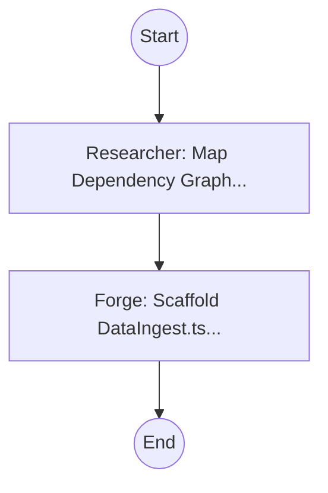

# 📊 Plan Visualization: e2e-golden-path

```mermaid
graph TD
    Start((Start))
    Start --> job_1["Researcher: Map Dependency Graph..."]
    job_1 --> job_2["Forge: Scaffold DataIngest.ts..."]
    job_2 --> End((End))
```