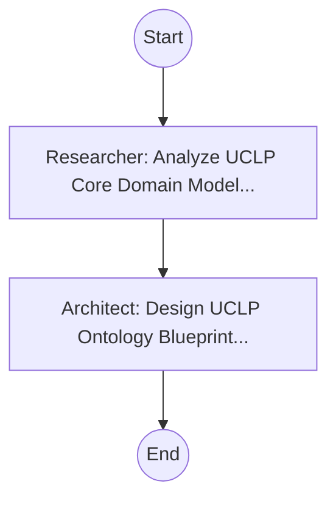

# 📊 Plan Visualization: uclp-refactor-phase1

```mermaid
graph TD
    Start((Start))
    Start --> job_1["Researcher: Analyze UCLP Core Domain Model..."]
    job_1 --> job_2["Architect: Design UCLP Ontology Blueprint..."]
    job_2 --> End((End))
```