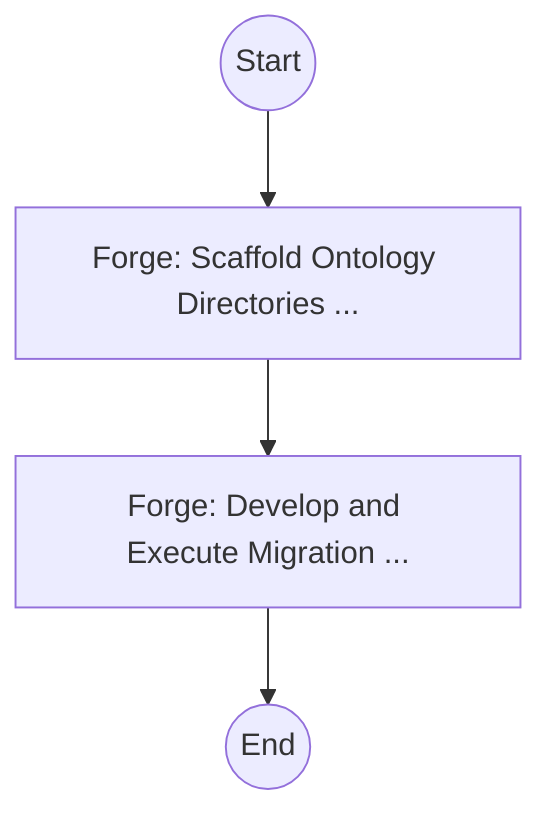

# 📊 Plan Visualization: uclp-refactor-phase2

```mermaid
graph TD
    Start((Start))
    Start --> job_1["Forge: Scaffold Ontology Directories ..."]
    job_1 --> job_2["Forge: Develop and Execute Migration ..."]
    job_2 --> End((End))
```