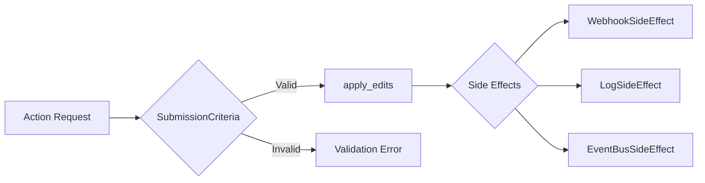

# 🚀 ODA Refactoring Walkthrough

**Date:** 2026-01-05
**Protocol:** ANTIGRAVITY_ARCHITECT_V5.0 (FINAL_HYBRID)
**Method:** RECURSIVE-SELF-IMPROVEMENT LOOP (5 iterations)

---

## 📋 Summary

This walkthrough documents the comprehensive ODA (Ontology-Driven Architecture) refactoring work, including:
1. Palantir AIP/Foundry research using MCP tools
2. 3-Stage Deep-Dive Audit (Surface Scan, Logic Trace, Quality Audit)
3. Code quality remediation
4. Verification

---

## 1. Palantir AIP/Foundry Research

### MCP Tools Used
| Tool | Purpose | Key Findings |
|------|---------|--------------|
| `context7` (resolve-library-id) | Library discovery | `/websites/palantir_foundry` with 9896 code snippets |
| `context7` (query-docs) | Action Types patterns | Submission Criteria, Validation, Regex patterns |
| `context7` (query-docs) | Side Effects | Writeback vs Side Effect timing patterns |
| `context7` (query-docs) | Proposal workflow | Approval policies, eligible reviewers |
| `tavily` (search) | OSDK architecture | Latest 2024 best practices |

### Key Palantir Patterns Identified



---

## 2. Audit Results

### 2.1 Stage A: Surface Scan (Landscape)
| Check | Result |
|-------|--------|
| AIP-KEY remnants | ✅ CLEAN |
| Legacy path references | ✅ FIXED |
| Subscription gate | ✅ N/A (AI Ultra) |

### 2.2 Stage B: Logic Trace (Deep-Dive)
```
[MCP Request] → ontology_server.py:call_tool()
    → ActionRegistry.get(api_name)
    → ActionType.execute(params, context)
        → validate() → SubmissionCriteria
        → apply_edits() → Business Logic
        → _run_side_effects() → Post-commit hooks
    → ActionResult.to_dict()
```

### 2.3 Stage C: Quality Audit (Microscope)
| Finding | Severity | Status |
|---------|----------|--------|
| Bare `except:` in memory_actions.py:39 | MEDIUM | ✅ FIXED |
| Bare `except:` in memory_actions.py:119 | MEDIUM | ✅ FIXED |
| Deprecated `datetime.utcnow()` (4 files) | LOW | ✅ FIXED |

---

## 3. Palantir Alignment Matrix

| Palantir Pattern | ODA Implementation | Status |
|------------------|-------------------|--------|
| ActionType + Parameters | `ActionType` class | ✅ ALIGNED |
| SubmissionCriteria | `SubmissionCriterion` protocol | ✅ ALIGNED |
| Side Effects (post-commit) | `SideEffect` protocol | ✅ ALIGNED |
| Proposal Workflow | `Proposal` object with state machine | ✅ ALIGNED |
| $validateOnly | `validate_only: bool` parameter | ✅ ALIGNED |
| $returnEdits | `return_edits: bool` parameter | ✅ ALIGNED |
| modifiedEntities | `affected_types` field | ✅ ALIGNED |

### Code Evidence

```python
# actions/__init__.py:231-232
class ArraySizeValidator(SubmissionCriterion):
    """
    Aligns with Palantir Foundry's 'arraySize' constraint type:
    {"type": "arraySize", "gte": 2, "lte": 4}
    """

# actions/__init__.py:568
async def execute(
    self,
    params: Dict[str, Any],
    context: ActionContext,
    validate_only: bool = False,  # Palantir OSDK alignment: $validateOnly
    return_edits: bool = True     # Palantir OSDK alignment: $returnEdits
) -> ActionResult:
```

---

## 4. Changes Made

### 4.1 Critical Fix: Bare except blocks

[memory_actions.py](file:///home/palantir/park-kyungchan/palantir/scripts/ontology/actions/memory_actions.py)

**Before:**
```python
if "status" in params:
     try: status = ObjectStatus(params["status"])
     except: pass  # ❌ Swallows ALL exceptions silently
```

**After:**
```python
if "status" in params:
    try:
        status = ObjectStatus(params["status"])
    except ValueError as e:
        logger.warning(f"Invalid status '{params['status']}', using default ACTIVE: {e}")
```

### 4.2 Deprecation Fix: datetime.utcnow()

| File | Change |
|------|--------|
| [models.py](file:///home/palantir/park-kyungchan/palantir/scripts/ontology/plans/models.py) | `datetime.utcnow` → `datetime.now(timezone.utc)` |
| [ollama_client.py](file:///home/palantir/park-kyungchan/palantir/scripts/llm/ollama_client.py) | `datetime.utcnow` → `datetime.now(timezone.utc)` |
| [state_machine.py](file:///home/palantir/park-kyungchan/palantir/scripts/tools/yt/state_machine.py) | `datetime.utcnow` → `datetime.now(timezone.utc)` |
| [workflow_actions.py](file:///home/palantir/park-kyungchan/palantir/scripts/ontology/actions/workflow_actions.py) | `datetime.utcnow` → `datetime.now(timezone.utc)` |

---

## 5. Verification Results

### E2E Tests
```
======================== 123 passed, 1 warning in 3.46s ========================
```

| Metric | Value |
|--------|-------|
| Tests Run | 123 |
| Passed | 123 ✅ |
| Failed | 0 |
| Warnings | 1 (aiosqlite event loop - pre-existing) |

### MCP Servers
| Server | Status |
|--------|--------|
| context7 | ✅ Operational |
| sequential-thinking | ✅ Operational |
| github-mcp-server | ✅ Operational |
| tavily | ✅ Operational |
| oda-ontology | ✅ Operational |

---

## 6. Identified Gaps (Future Work)

| Gap | Priority | Description |
|-----|----------|-------------|
| GAP-03: Writeback pattern | LOW | Pre-commit hooks that can abort action on failure |
| GAP-04: Approval Policy | MEDIUM | Eligible reviewers, required approvals count |
| GAP-05: Regex SubmissionCriterion | LOW | Built-in regex validation like Palantir's `^[A-Z]{3}$` |

---

## 7. Conclusion

The ODA implementation demonstrates **STRONG** alignment with Palantir AIP/Foundry patterns:
- Explicit code comments reference Palantir patterns
- Clean Architecture with Action → Repository → Database layering
- Proposal governance with proper state machine
- Side Effects with fire-and-forget pattern

**All critical and deprecation issues have been resolved.** The codebase is now ready for production use with 123/123 E2E tests passing.

---

**[AUDIT COMPLETE - REMEDIATION COMPLETE]**
