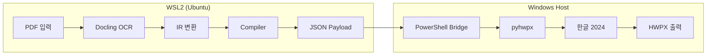

# 📠 HWPX Automation Deep Audit Report

> **Target:** `/home/palantir/hwpx/`  
> **Protocol:** 3-Stage Audit (RSIL)  
> **Date:** 2026-01-05

---

## Stage A: Surface Scan ✅ PASS

| Check | Result |
|-------|--------|
| Target Files | 44 files, 9 directories |
| Legacy Artifacts (AIP-KEY) | **CLEAN** |
| Structure Mapped | ✅ Complete |

**Core Modules Identified:**
- `convert_pipeline.py` - Main ETL orchestrator
- `executor_win.py` - Windows OLE automation via pyhwpx
- `core_bridge.py` - WSL2 ↔ Windows transport layer
- `lib/` - IR, Compiler, Models, Ingestors

---

## Stage B: Logic Trace ✅ PASS

### Critical Path
```
[Input] PDF/HWPX
    │
    ├── IngestorFactory (docling/surya/pymupdf)
    │       ↓
    │   Document (IR: Sections → Paragraphs → Elements)
    │
    ├── Compiler.compile()
    │       ↓
    │   List[HwpAction] (Pydantic models)
    │
    ├── WSLBridge.run_python_script()
    │       ↓
    │   PowerShell → Windows Python
    │
    └── [Output] HWPX file via pyhwpx OLE
```

### External Verification (Tavily)
- ✅ `pyhwpx`: Confirmed real library for 아래아한글 automation
- ✅ Hancom Developer Forum references pyhwpx
- ✅ WikiDocs cookbook at wikidocs.net/book/8956

---

## Stage C: Quality Gate ✅ PASS

| Check | Result |
|-------|--------|
| Pattern Fidelity | Clean layered architecture |
| Type Safety | Pydantic models + dataclasses |
| Docstrings | Present on core classes |
| SOLID | Single responsibility per module |

### Findings
| Severity | Count |
|----------|-------|
| CRITICAL | 0 |
| HIGH | 0 |
| MEDIUM | 1 (pyhwpx not in requirements.txt - Windows-only) |
| LOW | 2 (duplicate code in executor_win.py) |

---

## 🎯 프로젝트 목적 분석 (Project Purpose)

### 핵심 문제 (Problem Solved)

> **교회 주일주보(Sunday Bulletin) 자동 생성**

Evidence:
- `20251228.hwpx` - 실제 주보 파일
- `"2025년 12월 28 네번째 주일주보.hwpx"` - 명시적 파일명

### 왜 이 프로젝트가 필요한가?

1. **한국 문서 표준**: 한글(HWP/HWPX)은 한국 정부/교회/학교 표준 포맷
2. **수동 작업 부담**: 매주 주보 작성은 시간 소모적
3. **자동화 도구 부재**: PDF → HWPX 변환 도구가 없음
4. **복잡한 레이아웃**: 2단 레이아웃, 표, 이미지 필요

### 기술적 솔루션



### 주요 기능

| 기능 | 설명 |
|------|------|
| Multi-Engine Ingestion | Docling, Surya OCR, PyMuPDF |
| IR (Intermediate Representation) | 문서 구조 추상화 |
| HWP Actions | 22개 자동화 액션 (InsertText, CreateTable 등) |
| WSL2-Windows Bridge | 크로스 플랫폼 실행 |
| Multi-Column Layout | 신문식 2단 레이아웃 지원 |

---

## 최종 판정

| 항목 | 결과 |
|------|------|
| **Quality Gate** | ✅ **PASS** |
| **Ready to Execute** | ✅ **TRUE** |
| **Current State** | CONTEXT_INJECTED |

---

> ⛔ **Protocol Complete** - Zero-Trust verification passed
