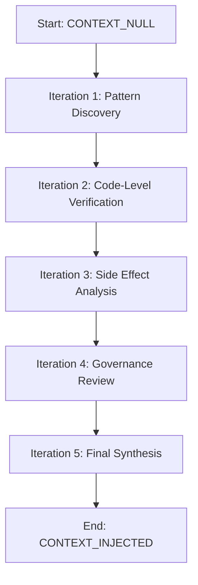

# Recursive Self-Improvement Loop (RSIL) Methodology

**Version:** 1.0
**Protocol:** ANTIGRAVITY_ARCHITECT_V5.0

---

## Overview

RSIL is a meta-cognitive audit methodology that uses `sequential-thinking` MCP tool to enforce iterative, verifiable analysis.

## Process



## Iteration Template

```json
{
  "thoughtNumber": N,
  "totalThoughts": 5,
  "nextThoughtNeeded": true/false,
  "thought": "Analysis content with code references"
}
```

## Key Principles

1. **Anti-Hallucination**: Each iteration MUST reference actual code
2. **Progressive Depth**: Landscape → Logic → Atomic
3. **Verification**: Findings become test assertions
4. **Traceability**: All iterations logged via MCP

## Integration with ODA

- Used during `/deep-audit` workflow
- Enforced by ANTIGRAVITY_ARCHITECT_V5.0 protocol
- Outputs feed into `audit/` artifacts
