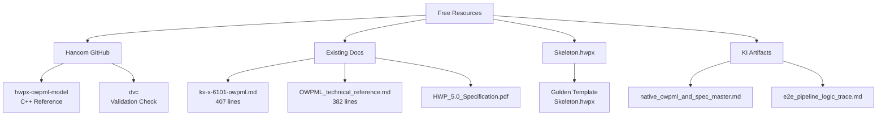
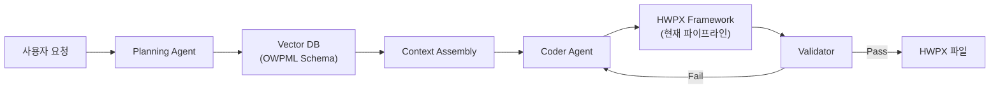

# KS X 6101:2024 표준 기반 OWPML 제어 프레임워크 구현 계획

## 목표

사용자가 제공한 연구 보고서 분석 결과를 바탕으로, **KS X 6101:2024 표준**에 기반한 AI 에이전트용 OWPML 제어 프레임워크의 실제 구현 가능성을 평가하고 구체적인 구현 계획을 수립한다.

---

## User Review Required

> [!IMPORTANT]
> **KS X 6101:2024 전체 스펙은 유료입니다** (₩167,200)
> 
> 한국표준협회(kssn.net)에서 구매해야 하며, 무료 다운로드는 불가능합니다.
> 현재 구현은 **2011/2018 버전 + Hancom 공식 GitHub 리소스**를 기반으로 합니다.

> [!WARNING]
> **Agentic RAG 아키텍처**는 별도의 대규모 프로젝트입니다.
> 
> 사용자 보고서에서 언급된 벡터 DB 기반 스키마 인식 RAG는 현재 파이프라인에 포함되어 있지 않으며,
> 구현 시 **LangChain/LangGraph + Chroma/Qdrant** 등 추가 인프라가 필요합니다.

---

## Stage A: Blueprint (현황 분석)

### 1. KS X 6101 표준 가용성

| 버전 | 상태 | 가격 | 접근성 |
|------|------|------|--------|
| KS X 6101:2011 | 구판 | 무료 참조 가능 | ✅ |
| KS X 6101:2018 | 구판 | 무료 참조 가능 | ✅ |
| **KS X 6101:2024** | 최신 (2024-10-30) | **₩167,200** | ❌ 유료 |

### 2. 무료 리소스 (현재 활용 가능)



### 3. 현재 구현 상태

| 사용자 보고서 요구사항 | 현재 상태 | 파일 위치 |
|----------------------|----------|----------|
| Unzip-Modify-Repack Pipeline | ✅ 구현됨 | [document_builder.py](file:///home/palantir/hwpx/lib/owpml/document_builder.py) |
| Header.xml ID 참조 관리 | ✅ 구현됨 | [header_manager.py](file:///home/palantir/hwpx/lib/owpml/header_manager.py) |
| BinData 이미지 처리 | ✅ 구현됨 | [bindata_manager.py](file:///home/palantir/hwpx/lib/owpml/bindata_manager.py) |
| OCF 패키징 준수 | ✅ 구현됨 | [package_normalizer.py](file:///home/palantir/hwpx/lib/owpml/package_normalizer.py) |
| HwpUnit 변환 | ✅ 구현됨 | [units.py](file:///home/palantir/hwpx/lib/owpml/units.py) |
| 네임스페이스 처리 | ✅ 구현됨 | `HP_NS`, `HS_NS`, `HH_NS` 상수 |
| XSD 스키마 검증 | ❌ 미구현 | 추가 필요 |
| Agentic RAG 계획 모듈 | ❌ 미구현 | 별도 프로젝트 |

---

## Stage B: Integration Trace (구현 계획)

### Phase 1: XSD 검증 레이어 추가 (권장)

**목표**: 생성된 OWPML XML이 스키마 규칙을 준수하는지 자동 검증

#### [NEW] lib/owpml/validator.py

```python
"""
OWPML Schema Validator
Based on Hancom hwpx-owpml-model structure
"""
from lxml import etree
from typing import List, Optional
from pathlib import Path

class OWPMLValidator:
    """Validates OWPML XML against inferred schema rules."""
    
    REQUIRED_FILES = [
        'mimetype',
        'version.xml',
        'Contents/content.hpf',
        'Contents/header.xml',
        'Contents/section0.xml',
        'META-INF/container.xml'
    ]
    
    NAMESPACES = {
        'hp': 'http://www.hancom.co.kr/hwpml/2011/paragraph',
        'hh': 'http://www.hancom.co.kr/hwpml/2011/head',
        'hs': 'http://www.hancom.co.kr/hwpml/2011/section',
        'opf': 'http://www.idpf.org/2007/opf'
    }
    
    def validate_package(self, hwpx_path: str) -> List[str]:
        """Validate HWPX package structure."""
        errors = []
        # ... implementation
        return errors
    
    def validate_id_references(self, header_xml: bytes, section_xml: bytes) -> List[str]:
        """Ensure all IDRef attributes reference valid header definitions."""
        errors = []
        # ... implementation
        return errors
```

#### [MODIFY] lib/owpml/document_builder.py

- **변경**: `_save()` 메서드에 검증 단계 추가
- **위치**: L662-691

```diff
def _save(self, output_path: str):
+   # Pre-save validation
+   from lib.owpml.validator import OWPMLValidator
+   validator = OWPMLValidator()
+   errors = validator.validate_id_references(...)
+   if errors:
+       logger.warning(f"Validation warnings: {errors}")
    
    # Write back modified section
    self.pkg.set_xml(self._section_path, self.section_elem)
    ...
```

---

### Phase 2: Hancom C++ 모델 스키마 추출 (선택)

**목표**: `hancom-io/hwpx-owpml-model`에서 요소/속성 제약 추출

#### 작업 항목

1. Clone `https://github.com/hancom-io/hwpx-owpml-model`
2. `OWPML/*.h` 헤더 파일에서 XML 요소 정의 파싱
3. Python dataclass로 변환하여 타입 안전성 확보

```bash
git clone https://github.com/hancom-io/hwpx-owpml-model.git /tmp/hwpx-owpml-model
```

---

### Phase 3: Agentic RAG 아키텍처 (미래 로드맵)

> [!CAUTION]
> 이 단계는 **별도의 대규모 프로젝트**로 분리해야 합니다.
> 현재 구현 범위에 포함하지 않습니다.

**필요 인프라**:
- Vector DB: Chroma, Qdrant, or Pinecone
- Embedding Model: OpenAI text-embedding-3-small 또는 로컬 모델
- Agent Framework: LangChain, LangGraph, or CrewAI
- Schema Chunking: XML 요소 단위 청킹 전략

**아키텍처 스케치**:



---

## Stage C: Verification Plan

### Automated Tests

```bash
# Phase 1 완료 후 실행
cd /home/palantir/hwpx
python -m pytest tests/ -v

# 검증 테스트 추가
python -m pytest tests/test_validator.py -v
```

### Manual Verification

1. 생성된 HWPX 파일을 Hancom Office 2024에서 열기
2. 복잡한 요소(표, 수식, 이미지) 렌더링 확인
3. 파일 손상 여부 확인

---

## Proposed Changes Summary

### Phase 1 (즉시 구현 가능)

| 작업 | 파일 | 설명 |
|------|------|------|
| [NEW] | `lib/owpml/validator.py` | OWPML 검증기 클래스 |
| [MODIFY] | `lib/owpml/document_builder.py` | 저장 전 검증 호출 추가 |
| [NEW] | `tests/test_validator.py` | 검증기 테스트 |

### Phase 2 (선택적)

| 작업 | 파일 | 설명 |
|------|------|------|
| [NEW] | `scripts/extract_schema.py` | Hancom C++ 헤더에서 스키마 추출 |
| [NEW] | `lib/schemas/owpml_types.py` | 추출된 타입 정의 |

### Phase 3 (미래 로드맵)

별도 프로젝트로 분리 - 현재 계획에 포함하지 않음

---

## Risk Assessment

| Risk Type | Probability | Impact | Mitigation |
|-----------|-------------|--------|------------|
| KS X 6101:2024 스펙 부재 | High | Medium | 2018 버전 + GitHub 리소스로 대체 |
| XSD 공식 스키마 없음 | High | Low | 규칙 기반 검증으로 대체 |
| Hancom Office 호환성 | Low | High | Skeleton.hwpx 템플릿 기반 보장 |

---

## 결론

1. **KS X 6101:2024 전체 스펙**은 유료(₩167,200)이며 무료 다운로드 불가
2. **현재 파이프라인**은 사용자 보고서의 대부분 요구사항을 이미 충족
3. **Phase 1 (XSD 검증)**만 즉시 구현 권장
4. **Agentic RAG**는 별도 프로젝트로 분리하여 미래 로드맵에 포함

---

*Generated by Antigravity Planning Protocol v6.0*
