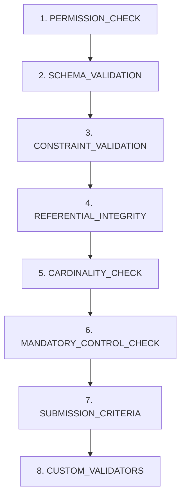

# Interaction Rules

이 문서는 Ontology 요소 간의 상호작용 규칙을 정의합니다. ObjectType, LinkType, ActionType 간의 관계와 제약 조건, 캐스케이드 동작, 보안 상호작용을 포함합니다.

**Schema Version:** 1.0.0
**Schema Reference:** `Interaction.schema.json`

---

## Overview

Interaction Rules는 ODA 시스템에서 다음 요소 간의 상호작용을 정의합니다:

| Interaction Type | Description |
|------------------|-------------|
| ObjectType-LinkType | ObjectType이 LinkType에 참여하는 방식 |
| ActionType-ObjectType | ActionType이 ObjectType에 대해 수행하는 작업 |
| ActionType-LinkType | ActionType이 Link에 대해 수행하는 작업 |
| Cascade Effects | 삭제/수정 시 연쇄적 영향 |
| Security Interactions | 보안 관련 상호작용 규칙 |

---

# Part 1: ObjectType-LinkType Interactions

ObjectType이 LinkType에 참여하는 방식을 정의합니다. 카디널리티, 외래키, 백킹 테이블 규칙을 포함합니다.

## ParticipationRule

ObjectType이 Link에 참여하는 방식을 정의하는 규칙입니다.

### Rule Structure

```json
{
  "ruleId": "primary-key-type-rule",
  "description": "All ObjectTypes must have UUID or STRING primary key for linking",
  "applicableTo": "ALL_OBJECT_TYPES",
  "objectTypeFilter": ["Employee", "Department"],
  "tagFilter": ["linkable"],
  "constraint": {
    "maxLinksAsSource": 10,
    "maxLinksAsTarget": 50,
    "requiredPrimaryKeyType": "STRING",
    "selfLinkAllowed": true
  },
  "enforcement": "STRICT"
}
```

### applicableTo

규칙이 적용되는 대상을 지정합니다:

| Value | Description |
|-------|-------------|
| `ALL_OBJECT_TYPES` | 모든 ObjectType에 적용 |
| `SPECIFIC_OBJECT_TYPES` | `objectTypeFilter`에 명시된 ObjectType에만 적용 |
| `OBJECT_TYPES_WITH_TAG` | `tagFilter`에 명시된 태그를 가진 ObjectType에 적용 |

### Constraint Properties

| Property | Type | Description | Default |
|----------|------|-------------|---------|
| `maxLinksAsSource` | integer | Source로 참여 가능한 최대 LinkType 수 | - |
| `maxLinksAsTarget` | integer | Target으로 참여 가능한 최대 LinkType 수 | - |
| `requiredPrimaryKeyType` | enum | 링크에 필요한 PK 타입 (`STRING`, `INTEGER`, `LONG`, `UUID`) | - |
| `selfLinkAllowed` | boolean | 자기 자신에 대한 링크 허용 여부 | `true` |

### Enforcement Levels

| Level | Behavior |
|-------|----------|
| `STRICT` | 위반 시 작업 거부 |
| `WARN` | 위반 시 경고 후 허용 |
| `AUDIT_ONLY` | 위반 기록만 남김, 작업 허용 |

---

## CardinalityEnforcementConfig

카디널리티 제약 조건의 적용 방식을 구성합니다.

### Configuration Structure

```json
{
  "oneToOneEnforcement": "INDICATOR_ONLY",
  "oneToManyEnforcement": "STRICT",
  "manyToOneEnforcement": "STRICT",
  "manyToManyEnforcement": "STRICT",
  "minCardinalityEnforcement": "DEFERRED",
  "violationBehavior": "REJECT"
}
```

### oneToOneEnforcement

1:1 관계의 적용 방식:

| Value | Description |
|-------|-------------|
| `STRICT` | 엄격하게 1:1 강제 |
| `INDICATOR_ONLY` | 표시용으로만 사용 (Palantir 권장) |
| `DISABLED` | 적용 안 함 |

> **Note:** Palantir Foundry는 1:1을 indicator로만 취급합니다. 실제로는 1:N처럼 동작할 수 있습니다.

### oneToManyEnforcement / manyToOneEnforcement

1:N 및 N:1 관계의 적용 방식:

| Value | Description | Default |
|-------|-------------|---------|
| `STRICT` | 위반 시 거부 | **Default** |
| `WARN` | 경고 후 허용 | |
| `DISABLED` | 적용 안 함 | |

### manyToManyEnforcement

N:N 관계는 항상 백킹 테이블이 필요하므로 `STRICT`만 허용됩니다.

### minCardinalityEnforcement

최소 카디널리티(예: sourceMin=1) 적용 시점:

| Value | Description | Default |
|-------|-------------|---------|
| `ON_CREATE` | 객체 생성 시 즉시 검증 | |
| `ON_COMMIT` | 트랜잭션 커밋 시 검증 | |
| `DEFERRED` | 지연된 검증 (배치 작업 등) | **Default** |
| `DISABLED` | 검증 안 함 | |

### violationBehavior

카디널리티 위반 시 동작:

| Value | Description | Default |
|-------|-------------|---------|
| `REJECT` | 작업 거부 | **Default** |
| `WARN_AND_ALLOW` | 경고 후 허용 | |
| `AUTO_CORRECT` | 자동 수정 시도 | |

---

## ForeignKeyRulesConfig

외래키 기반 링크(1:1, 1:N, N:1)에 대한 규칙입니다.

### Configuration Structure

```json
{
  "nullForeignKeyAllowed": true,
  "orphanedForeignKeyBehavior": "REJECT",
  "indexingRequired": true,
  "typeValidation": "STRICT"
}
```

### nullForeignKeyAllowed

| Value | Description | Default |
|-------|-------------|---------|
| `true` | FK가 null 허용 (선택적 관계) | **Default** |
| `false` | FK 필수 (필수 관계) | |

### orphanedForeignKeyBehavior (onDeleteBehavior)

FK가 존재하지 않는 객체를 참조할 때의 동작:

| Value | Description | Default |
|-------|-------------|---------|
| `REJECT` | 작업 거부 | **Default** |
| `SET_NULL` | FK를 null로 설정 | |
| `CREATE_PLACEHOLDER` | 플레이스홀더 객체 생성 | |
| `IGNORE` | 무시하고 진행 | |

### indexingRequired (indexForeignKey)

| Value | Description | Default |
|-------|-------------|---------|
| `true` | FK 컬럼에 인덱스 필수 | **Default** |
| `false` | 인덱스 선택적 | |

### typeValidation

FK 타입과 PK 타입 일치 검증:

| Value | Description | Default |
|-------|-------------|---------|
| `STRICT` | 정확한 타입 일치 필요 | **Default** |
| `COERCIBLE` | 변환 가능한 타입 허용 | |
| `DISABLED` | 타입 검증 안 함 | |

---

## BackingTableRulesConfig

백킹 테이블 기반 링크(N:N)에 대한 규칙입니다.

### Configuration Structure

```json
{
  "backingTableRequired": true,
  "duplicateLinkBehavior": "REJECT",
  "linkPropertyRequired": false,
  "auditColumns": {
    "createdAt": true,
    "createdBy": true,
    "modifiedAt": false,
    "modifiedBy": false
  }
}
```

### backingTableRequired

N:N 링크는 **반드시** 백킹 테이블이 필요합니다. 이 값은 항상 `true`입니다.

### duplicateLinkBehavior

동일한 source-target 쌍의 중복 링크 생성 시:

| Value | Description | Default |
|-------|-------------|---------|
| `REJECT` | 중복 링크 거부 | **Default** |
| `MERGE` | 기존 링크와 병합 | |
| `ALLOW_DUPLICATE` | 중복 허용 | |

### linkPropertyRequired

| Value | Description | Default |
|-------|-------------|---------|
| `true` | 최소 하나의 링크 프로퍼티 필수 | |
| `false` | 링크 프로퍼티 선택적 | **Default** |

### auditColumns (auditColumnsRequired)

백킹 테이블에 자동 추가되는 감사 컬럼:

| Column | Type | Description | Default |
|--------|------|-------------|---------|
| `createdAt` | timestamp | 링크 생성 시간 | `true` |
| `createdBy` | string | 링크 생성자 | `true` |
| `modifiedAt` | timestamp | 링크 수정 시간 | `false` |
| `modifiedBy` | string | 링크 수정자 | `false` |

---

# Part 2: ActionType-ObjectType Interactions

ActionType이 ObjectType에 대해 수행하는 작업 규칙을 정의합니다.

## CreateOperationRules

객체 생성(CREATE) 작업에 대한 규칙입니다.

### Configuration Structure

```json
{
  "primaryKeyGeneration": "UUID",
  "requiredPropertyValidation": "IMMEDIATE",
  "defaultValueApplication": "ON_MISSING_ONLY",
  "mandatoryControlValidation": "IMMEDIATE",
  "auditCreation": true,
  "statusInitialization": "ACTIVE"
}
```

### primaryKeyGeneration

새 객체의 Primary Key 생성 방식:

| Value | Description | Default |
|-------|-------------|---------|
| `MANUAL` | 사용자가 직접 제공 | |
| `AUTO_INCREMENT` | 자동 증가 정수 | |
| `UUID` | UUID 자동 생성 | **Default** |
| `CUSTOM_FUNCTION` | 사용자 정의 함수 | |

### requiredPropertyValidation (requiredPropertiesValidation)

필수 프로퍼티 검증 시점:

| Value | Description | Default |
|-------|-------------|---------|
| `IMMEDIATE` | 생성 즉시 검증 | **Default** |
| `ON_COMMIT` | 트랜잭션 커밋 시 | |
| `DEFERRED` | 지연 검증 | |

### defaultValueApplication

기본값 적용 방식:

| Value | Description | Default |
|-------|-------------|---------|
| `ON_CREATE` | 생성 시 항상 적용 | |
| `ON_MISSING_ONLY` | 값이 없을 때만 적용 | **Default** |
| `NEVER` | 기본값 적용 안 함 | |

### mandatoryControlValidation

보안 필수 프로퍼티(Mandatory Control) 검증 시점:

| Value | Description | Default |
|-------|-------------|---------|
| `IMMEDIATE` | 생성 즉시 검증 | **Default** |
| `ON_COMMIT` | 트랜잭션 커밋 시 | |

### auditCreation (auditTrailCreation)

| Value | Description | Default |
|-------|-------------|---------|
| `true` | `createdAt`, `createdBy` 자동 설정 | **Default** |
| `false` | 감사 필드 자동 설정 안 함 | |

### statusInitialization

새 객체의 초기 상태:

| Value | Description | Default |
|-------|-------------|---------|
| `ACTIVE` | 활성 상태로 생성 | **Default** |
| `DRAFT` | 초안 상태로 생성 | |
| `PENDING` | 대기 상태로 생성 | |

---

## ModifyOperationRules

객체 수정(MODIFY) 작업에 대한 규칙입니다.

### Configuration Structure

```json
{
  "immutablePropertyEnforcement": "STRICT",
  "versionIncrement": true,
  "optimisticLocking": true,
  "auditModification": true,
  "partialUpdateAllowed": true,
  "nullifyBehavior": "REJECTED_IF_REQUIRED",
  "mandatoryControlModification": "RESTRICTED"
}
```

### immutablePropertyEnforcement (immutableFieldProtection)

불변 프로퍼티 보호 방식:

| Value | Description | Default |
|-------|-------------|---------|
| `STRICT` | 불변 필드 수정 시 작업 거부 | **Default** |
| `WARN` | 경고 후 허용 | |
| `DISABLED` | 보호 안 함 | |

### concurrencyControl

동시성 제어 방식:

| Property | Value | Description |
|----------|-------|-------------|
| `versionIncrement` | boolean | 수정 시 버전 자동 증가 (Default: `true`) |
| `optimisticLocking` | boolean | 낙관적 잠금 사용 (Default: `true`) |

**Concurrency Control Strategies:**

| Strategy | Description |
|----------|-------------|
| `OPTIMISTIC_LOCKING` | 버전 기반 충돌 감지 (권장) |
| `PESSIMISTIC_LOCKING` | 배타적 잠금 획득 |
| `LAST_WRITE_WINS` | 마지막 쓰기 우선 |

### partialUpdateSupport

| Value | Description | Default |
|-------|-------------|---------|
| `true` | 일부 프로퍼티만 업데이트 허용 | **Default** |
| `false` | 전체 객체 교체 필요 | |

### nullifyBehavior

프로퍼티를 null로 설정할 때:

| Value | Description | Default |
|-------|-------------|---------|
| `ALLOWED` | null 설정 항상 허용 | |
| `REJECTED_IF_REQUIRED` | 필수 프로퍼티는 null 불가 | **Default** |
| `CONVERT_TO_DEFAULT` | null 대신 기본값 적용 | |

### mandatoryControlModification

보안 필수 프로퍼티 수정 허용 여부:

| Value | Description | Default |
|-------|-------------|---------|
| `ALLOWED` | 수정 허용 | |
| `RESTRICTED` | 제한적 수정 (권한 필요) | **Default** |
| `PROHIBITED` | 수정 금지 | |

---

## DeleteOperationRules

객체 삭제(DELETE) 작업에 대한 규칙입니다.

### Configuration Structure

```json
{
  "softDeleteEnabled": true,
  "hardDeleteAllowed": false,
  "linkedObjectBehavior": "REJECT_IF_LINKED",
  "retentionPeriod": 90,
  "auditDeletion": true,
  "statusTransition": {
    "required": true,
    "deprecationPeriodDays": 30
  }
}
```

### softDeleteSupport

| Value | Description | Default |
|-------|-------------|---------|
| `true` | 소프트 삭제 사용 (상태를 DELETED로 변경) | **Default** |
| `false` | 소프트 삭제 미사용 | |

### hardDeleteAllowed

| Value | Description | Default |
|-------|-------------|---------|
| `true` | 영구 삭제 허용 | |
| `false` | 영구 삭제 금지 | **Default** |

### cascadeDeleteRules / orphanHandling (linkedObjectBehavior)

삭제 시 연결된 객체 처리:

| Value | Description | Default |
|-------|-------------|---------|
| `REJECT_IF_LINKED` | 링크가 있으면 삭제 거부 | **Default** |
| `CASCADE_DELETE` | 연결된 객체도 삭제 | |
| `UNLINK` | 링크만 제거 | |
| `ORPHAN` | 링크는 유지하되 고아 상태 허용 | |

### retentionPeriod

소프트 삭제된 객체의 보존 기간(일):

| Property | Type | Description | Default |
|----------|------|-------------|---------|
| `retentionPeriod` | integer | 자동 제거까지의 일수 | `90` |

### statusTransition

삭제 전 필수 상태 전환:

| Property | Type | Description | Default |
|----------|------|-------------|---------|
| `required` | boolean | DEPRECATED 상태 경유 필수 | `true` |
| `deprecationPeriodDays` | integer | DEPRECATED 최소 유지 기간 | `30` |

---

## PermissionIntegrationConfig

작업 시 권한 검사 방식을 정의합니다.

### Configuration Structure

```json
{
  "checkTiming": "BEFORE_VALIDATION",
  "resolutionOrder": ["INSTANCE", "OBJECT_TYPE", "TEAM", "ROLE", "DEFAULT"],
  "denyOverridesAllow": true,
  "mandatoryControlIntegration": true
}
```

### checkPermissionsBeforeAction (checkTiming)

권한 검사 시점:

| Value | Description | Default |
|-------|-------------|---------|
| `BEFORE_VALIDATION` | 스키마 검증 전 권한 검사 | **Default** |
| `AFTER_VALIDATION` | 스키마 검증 후 권한 검사 | |
| `BOTH` | 양쪽 모두에서 검사 | |

### Permission Resolution Order (ODA 5-Layer Model)

권한 해석 순서:

1. **INSTANCE** - 개별 객체 인스턴스 권한
2. **OBJECT_TYPE** - ObjectType 레벨 권한
3. **TEAM** - 팀 기반 권한
4. **ROLE** - 역할 기반 권한
5. **DEFAULT** - 기본 권한

### permissionDeniedBehavior

| Property | Value | Description |
|----------|-------|-------------|
| `denyOverridesAllow` | `true` | 명시적 DENY가 항상 우선 (Default) |
| `mandatoryControlIntegration` | `true` | Row-level 보안을 위한 MC 통합 |

---

# Part 3: ActionType-LinkType Interactions

ActionType이 Link에 대해 수행하는 작업 규칙을 정의합니다.

## LinkOperationRules

링크 생성(CREATE_LINK) 작업에 대한 규칙입니다.

### Configuration Structure

```json
{
  "existenceValidation": "STRICT",
  "cardinalityValidation": "STRICT",
  "duplicateLinkBehavior": "REJECT",
  "bidirectionalCreation": true,
  "linkPropertyDefaults": true
}
```

### validationBeforeLink

링크 생성 전 검증:

| Property | Value | Description | Default |
|----------|-------|-------------|---------|
| `existenceValidation` | `STRICT` | source/target 객체 존재 여부 검증 | **Default** |
| | `WARN` | 경고 후 허용 | |
| | `DISABLED` | 검증 안 함 | |
| `cardinalityValidation` | `STRICT` | 카디널리티 제약 검증 | **Default** |

### duplicateLinkPolicy

동일 링크 중복 생성 시:

| Value | Description | Default |
|-------|-------------|---------|
| `REJECT` | 중복 링크 거부 | **Default** |
| `UPDATE_PROPERTIES` | 기존 링크의 프로퍼티 업데이트 | |
| `IGNORE` | 무시 (작업 성공으로 처리) | |

### Additional Rules

| Property | Type | Description | Default |
|----------|------|-------------|---------|
| `bidirectionalCreation` | boolean | 역방향 네비게이션 자동 생성 | `true` |
| `linkPropertyDefaults` | boolean | 링크 프로퍼티에 기본값 적용 | `true` |

---

## UnlinkOperationRules

링크 제거(DELETE_LINK) 작업에 대한 규칙입니다.

### Configuration Structure

```json
{
  "nonExistentLinkBehavior": "IGNORE",
  "cascadeToBackingTable": true,
  "auditUnlink": true,
  "orphanProtection": true
}
```

### Non-existent Link Behavior

존재하지 않는 링크 제거 시도 시:

| Value | Description | Default |
|-------|-------------|---------|
| `REJECT` | 작업 거부 (에러 반환) | |
| `IGNORE` | 무시 (작업 성공으로 처리) | **Default** |

### orphanCheckRequired (orphanProtection)

| Value | Description | Default |
|-------|-------------|---------|
| `true` | 최소 카디널리티 위반 방지 | **Default** |
| `false` | 고아 상태 허용 | |

### cascadeUnlink (cascadeToBackingTable)

| Value | Description | Default |
|-------|-------------|---------|
| `true` | N:N의 경우 백킹 테이블 행 삭제 | **Default** |
| `false` | 백킹 테이블 행 유지 | |

### auditUnlink

| Value | Description | Default |
|-------|-------------|---------|
| `true` | 링크 제거 감사 로그 기록 | **Default** |
| `false` | 감사 로그 기록 안 함 | |

---

# Part 4: Cascade Effects

객체/링크 수정/삭제 시 연쇄적으로 발생하는 효과를 정의합니다.

## objectDeleteCascade

객체 삭제 시 캐스케이드 동작입니다.

### Configuration Structure

```json
{
  "linksFromObject": "CASCADE_DELETE",
  "linksToObject": "CASCADE_DELETE",
  "nestedObjects": "CASCADE_DELETE"
}
```

### cascadeToLinks

#### linksFromObject (삭제된 객체가 Source인 링크)

| Value | Description | Default |
|-------|-------------|---------|
| `CASCADE_DELETE` | 링크도 함께 삭제 | **Default** |
| `ORPHAN` | 링크 유지 (고아 상태) | |
| `REJECT` | 링크 존재 시 삭제 거부 | |

#### linksToObject (삭제된 객체가 Target인 링크)

| Value | Description | Default |
|-------|-------------|---------|
| `CASCADE_DELETE` | 링크도 함께 삭제 | **Default** |
| `SET_NULL` | FK를 null로 설정 | |
| `ORPHAN` | 링크 유지 (고아 상태) | |
| `REJECT` | 링크 존재 시 삭제 거부 | |

### cascadeToActions (nestedObjects)

삭제된 객체가 소유한 중첩 객체:

| Value | Description | Default |
|-------|-------------|---------|
| `CASCADE_DELETE` | 중첩 객체도 삭제 | **Default** |
| `ORPHAN` | 중첩 객체 유지 (고아 상태) | |
| `REJECT` | 중첩 객체 존재 시 삭제 거부 | |

### notificationOnCascade

캐스케이드 삭제 시 알림 설정은 시스템 레벨에서 구성됩니다.

---

## linkTypeDeleteCascade

LinkType이 스키마에서 삭제될 때의 캐스케이드 동작입니다.

### Configuration Structure

```json
{
  "linkInstances": "CASCADE_DELETE",
  "backingTableData": "CASCADE_DELETE"
}
```

### removeExistingLinks (linkInstances)

기존 링크 인스턴스 처리:

| Value | Description | Default |
|-------|-------------|---------|
| `CASCADE_DELETE` | 모든 링크 인스턴스 삭제 | **Default** |
| `ARCHIVE` | 링크 인스턴스 아카이브 | |
| `REJECT` | 링크 인스턴스 존재 시 삭제 거부 | |

### backingTableData

백킹 테이블 데이터 처리:

| Value | Description | Default |
|-------|-------------|---------|
| `CASCADE_DELETE` | 백킹 테이블 데이터 삭제 | **Default** |
| `ARCHIVE` | 데이터 아카이브 | |
| `PRESERVE` | 데이터 보존 | |

### notifyAffectedObjects

영향받는 객체에 대한 알림은 시스템 이벤트를 통해 전파됩니다.

---

## statusTransitionCascade

객체 상태 변경 시 연쇄 효과입니다.

### Configuration Structure

```json
{
  "onDeprecate": "WARN_LINKED",
  "onArchive": "UNLINK"
}
```

### propagateToLinks (onDeprecate)

객체가 DEPRECATED 상태로 전환될 때:

| Value | Description | Default |
|-------|-------------|---------|
| `WARN_LINKED` | 연결된 객체에 경고 | **Default** |
| `DEPRECATE_LINKED` | 연결된 객체도 DEPRECATED로 변경 | |
| `NO_ACTION` | 아무 조치 안 함 | |

### propagateToActions (onArchive)

객체가 ARCHIVED 상태로 전환될 때:

| Value | Description | Default |
|-------|-------------|---------|
| `ARCHIVE_LINKED` | 연결된 객체도 아카이브 | |
| `UNLINK` | 링크 제거 | **Default** |
| `NO_ACTION` | 아무 조치 안 함 | |

### maxCascadeDepth

무한 루프 방지를 위한 최대 캐스케이드 깊이:

| Property | Type | Min | Max | Default |
|----------|------|-----|-----|---------|
| `maxCascadeDepth` | integer | 1 | 10 | `5` |

---

# Part 5: Security Interactions

보안 관련 상호작용 규칙입니다. Palantir P1-CRITICAL 요구사항을 준수합니다.

## mandatoryControlEnforcement

Mandatory Control 프로퍼티의 작업 연동 방식입니다.

### Configuration Structure

```json
{
  "onCreate": "REQUIRED",
  "onModify": "ALLOWED_WITH_APPROVAL",
  "inheritanceFromSource": true,
  "unionWithTarget": false
}
```

### enforceOnRead / enforceOnWrite

| Operation | Value | Description | Default |
|-----------|-------|-------------|---------|
| `onCreate` | `REQUIRED` | MC 필수 설정 | **Default** |
| | `ALLOW_EMPTY_ARRAY` | 빈 배열 허용 | |
| | `DISABLED` | 검증 안 함 | |
| `onModify` | `RESTRICTED` | 제한적 수정 | |
| | `ALLOWED_WITH_APPROVAL` | 승인 후 수정 | **Default** |
| | `PROHIBITED` | 수정 금지 | |

### inheritanceRules

| Property | Type | Description | Default |
|----------|------|-------------|---------|
| `inheritanceFromSource` | boolean | 링크가 source 객체의 보안 상속 | `true` |
| `unionWithTarget` | boolean | source와 target 모두 보이는 경우만 링크 표시 | `false` |

---

## restrictedViewIntegration

Restricted View가 작업에 영향을 미치는 방식입니다.

### Configuration Structure

```json
{
  "filterOnRead": true,
  "filterOnWrite": true,
  "filterOnLink": true,
  "policyEvaluationOrder": ["MARKINGS", "ORGANIZATIONS", "CLASSIFICATIONS"]
}
```

### viewResolutionOrder (policyEvaluationOrder)

RV 정책 평가 순서:

1. **MARKINGS** - 보안 마킹 기반 필터
2. **ORGANIZATIONS** - 조직 기반 필터
3. **CLASSIFICATIONS** - 분류 기반 필터
4. **CUSTOM** - 사용자 정의 필터

### Filter Settings

| Property | Type | Description | Default |
|----------|------|-------------|---------|
| `filterOnRead` | boolean | 읽기 작업에 RV 필터 적용 | `true` |
| `filterOnWrite` | boolean | 쓰기 작업에 RV 필터 적용 | `true` |
| `filterOnLink` | boolean | 링크 생성에 RV 필터 적용 | `true` |

### conflictResolutionPolicy

여러 RV 정책 충돌 시 가장 제한적인 정책이 적용됩니다 (Most Restrictive Wins).

---

## fieldLevelSecurity

필드 레벨 보안 상호작용 규칙입니다.

### Configuration Structure

```json
{
  "maskingOnRead": true,
  "hiddenPropertiesInResponse": "OMIT",
  "auditHiddenAccess": true
}
```

### sensitiveFieldMasking (maskingOnRead)

MASKED 프로퍼티 읽기 시:

| Value | Description | Default |
|-------|-------------|---------|
| `true` | 마스킹 적용 (예: "****") | **Default** |
| `false` | 마스킹 미적용 | |

### hiddenPropertiesInResponse

HIDDEN 프로퍼티 응답 처리:

| Value | Description | Default |
|-------|-------------|---------|
| `OMIT` | 응답에서 완전히 제외 | **Default** |
| `NULL` | null 값으로 표시 | |
| `REDACTED_MARKER` | "[REDACTED]" 마커 표시 | |

### auditSensitiveAccess (auditHiddenAccess)

| Value | Description | Default |
|-------|-------------|---------|
| `true` | HIDDEN 프로퍼티 접근 시도 로깅 | **Default** |
| `false` | 로깅 안 함 | |

---

# Part 6: Validation Order

작업 수행 시 검증이 실행되는 순서를 정의합니다.

## operationValidationOrder

### Default Validation Sequence



### Validation Steps

| Order | Step | Description |
|-------|------|-------------|
| 1 | `PERMISSION_CHECK` | 사용자 권한 검증 |
| 2 | `SCHEMA_VALIDATION` | 스키마 적합성 검증 |
| 3 | `CONSTRAINT_VALIDATION` | 프로퍼티 제약조건 검증 |
| 4 | `REFERENTIAL_INTEGRITY` | 참조 무결성 검증 |
| 5 | `CARDINALITY_CHECK` | 카디널리티 제약 검증 |
| 6 | `MANDATORY_CONTROL_CHECK` | 보안 필수 프로퍼티 검증 |
| 7 | `SUBMISSION_CRITERIA` | 제출 조건 검증 |
| 8 | `CUSTOM_VALIDATORS` | 사용자 정의 검증 |

### Configuration Structure

```json
{
  "operationValidationOrder": [
    "PERMISSION_CHECK",
    "SCHEMA_VALIDATION",
    "CONSTRAINT_VALIDATION",
    "REFERENTIAL_INTEGRITY",
    "CARDINALITY_CHECK",
    "MANDATORY_CONTROL_CHECK",
    "SUBMISSION_CRITERIA",
    "CUSTOM_VALIDATORS"
  ],
  "failFast": true,
  "collectAllErrors": false
}
```

### Validation Behavior

| Property | Type | Description | Default |
|----------|------|-------------|---------|
| `failFast` | boolean | 첫 번째 실패 시 즉시 중단 | `true` |
| `collectAllErrors` | boolean | 모든 오류 수집 후 반환 | `false` |

> **Note:** `failFast=false`이고 `collectAllErrors=true`인 경우, 모든 검증 오류가 수집되어 한 번에 반환됩니다.

---

## Referential Integrity Rules

참조 무결성 규칙은 별도로 정의됩니다.

### Configuration Structure

```json
{
  "enforcementLevel": "STRICT",
  "foreignKeyIntegrity": {
    "onInsert": "VALIDATE",
    "onUpdate": "VALIDATE"
  },
  "orphanDetection": {
    "enabled": true,
    "frequency": "DAILY",
    "action": "REPORT"
  },
  "circularReferenceHandling": "WARN"
}
```

### Enforcement Level

| Value | Description | Default |
|-------|-------------|---------|
| `STRICT` | 즉시 강제 | **Default** |
| `EVENTUAL` | 최종 일관성 (비동기) | |
| `DISABLED` | 강제 안 함 | |

### Foreign Key Integrity

| Operation | Value | Description | Default |
|-----------|-------|-------------|---------|
| `onInsert` | `VALIDATE` | 삽입 시 FK 검증 | **Default** |
| | `DEFER` | 지연 검증 | |
| | `DISABLED` | 검증 안 함 | |
| `onUpdate` | `VALIDATE` | 업데이트 시 FK 검증 | **Default** |

### Orphan Detection

| Property | Type | Description | Default |
|----------|------|-------------|---------|
| `enabled` | boolean | 고아 감지 활성화 | `true` |
| `frequency` | enum | 감지 주기 (`REALTIME`, `HOURLY`, `DAILY`, `WEEKLY`) | `DAILY` |
| `action` | enum | 감지 시 조치 (`REPORT`, `AUTO_CLEANUP`, `QUARANTINE`) | `REPORT` |

### Circular Reference Handling

| Value | Description | Default |
|-------|-------------|---------|
| `ALLOW` | 순환 참조 허용 | |
| `WARN` | 경고 후 허용 | **Default** |
| `REJECT` | 순환 참조 거부 | |

---

# Examples

## Example 1: Basic Interaction Configuration

```json
{
  "schemaVersion": "1.0.0",
  "objectTypeToLinkType": {
    "participationRules": [
      {
        "ruleId": "primary-key-type-rule",
        "description": "All ObjectTypes must have UUID or STRING primary key for linking",
        "applicableTo": "ALL_OBJECT_TYPES",
        "constraint": {
          "requiredPrimaryKeyType": "STRING",
          "selfLinkAllowed": true
        },
        "enforcement": "STRICT"
      }
    ],
    "cardinalityEnforcement": {
      "oneToOneEnforcement": "INDICATOR_ONLY",
      "oneToManyEnforcement": "STRICT",
      "manyToManyEnforcement": "STRICT",
      "minCardinalityEnforcement": "DEFERRED",
      "violationBehavior": "REJECT"
    }
  },
  "actionTypeToObjectType": {
    "createRules": {
      "primaryKeyGeneration": "UUID",
      "auditCreation": true,
      "statusInitialization": "ACTIVE"
    },
    "modifyRules": {
      "immutablePropertyEnforcement": "STRICT",
      "optimisticLocking": true,
      "partialUpdateAllowed": true
    },
    "deleteRules": {
      "softDeleteEnabled": true,
      "hardDeleteAllowed": false,
      "linkedObjectBehavior": "REJECT_IF_LINKED",
      "retentionPeriod": 90
    }
  }
}
```

## Example 2: Cascade Configuration for Parent-Child Relationship

```json
{
  "cascadeEffects": {
    "objectDeleteCascade": {
      "linksFromObject": "CASCADE_DELETE",
      "linksToObject": "CASCADE_DELETE",
      "nestedObjects": "CASCADE_DELETE"
    },
    "statusTransitionCascade": {
      "onDeprecate": "WARN_LINKED",
      "onArchive": "UNLINK"
    },
    "maxCascadeDepth": 5
  }
}
```

## Example 3: Security-First Configuration

```json
{
  "securityInteractions": {
    "mandatoryControlEnforcement": {
      "onCreate": "REQUIRED",
      "onModify": "ALLOWED_WITH_APPROVAL",
      "inheritanceFromSource": true,
      "unionWithTarget": false
    },
    "restrictedViewIntegration": {
      "filterOnRead": true,
      "filterOnWrite": true,
      "filterOnLink": true,
      "policyEvaluationOrder": ["MARKINGS", "ORGANIZATIONS", "CLASSIFICATIONS"]
    },
    "fieldLevelSecurity": {
      "maskingOnRead": true,
      "hiddenPropertiesInResponse": "OMIT",
      "auditHiddenAccess": true
    }
  }
}
```

## Example 4: Custom Validation Order

```json
{
  "validationOrder": {
    "operationValidationOrder": [
      "PERMISSION_CHECK",
      "MANDATORY_CONTROL_CHECK",
      "SCHEMA_VALIDATION",
      "CONSTRAINT_VALIDATION",
      "REFERENTIAL_INTEGRITY",
      "CARDINALITY_CHECK",
      "SUBMISSION_CRITERIA",
      "CUSTOM_VALIDATORS"
    ],
    "failFast": false,
    "collectAllErrors": true
  }
}
```

> **Note:** 이 예제에서는 `MANDATORY_CONTROL_CHECK`가 `SCHEMA_VALIDATION`보다 먼저 수행되어 보안 검증을 우선시합니다.

---

## Related Documentation

- [ObjectType.md](./ObjectType.md) - ObjectType 정의
- [LinkType.md](./LinkType.md) - LinkType 정의
- [ActionType.md](./ActionType.md) - ActionType 정의
- [Security.md](./Security.md) - 보안 구성
- [Validation.md](./Validation.md) - 검증 규칙

---

## Schema Reference

**Full Schema Location:** `/docs/research/schemas/Interaction.schema.json`

**Schema Version:** 1.0.0

**JSON Schema Draft:** 2020-12
