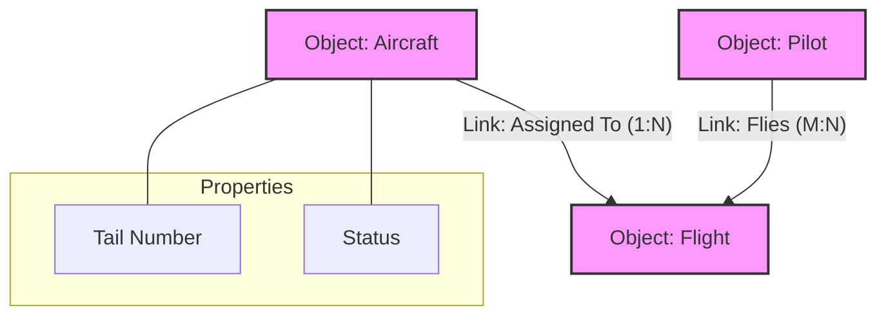
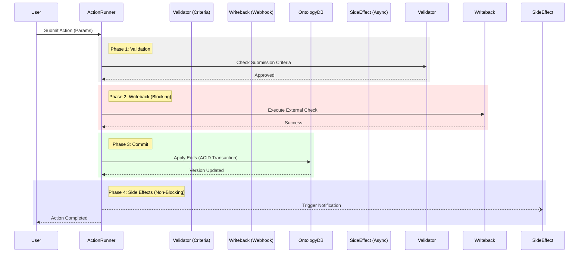
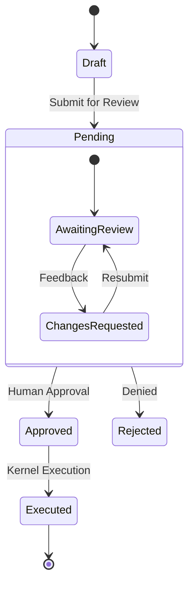

# Palantir FDE Learning: Visual Glossary & Architecture Map

## 1. The Core Ontology (The "Brain")
In Palantir Foundry and Orion ODA, the **Ontology** is the semantic layer that maps raw data to real-world concepts. It is the *Single Source of Truth*.

### 1.1 Core Components
| Term | Definition | Orion Implementation |
|:--- |:--- |:--- |
| **Ontology Object** | A meaningful entity (e.g., `Aircraft`, `Employee`) defined by a rigid schema. Inherits from `OntologyObject`. | `scripts.ontology.ontology_types.OntologyObject` |
| **Object Set** | A collection of objects, often defined by a filter or query (e.g., "All Aircraft in NY"). In OSDK, this is a lazy query builder. | `scripts.osdk.object_set.ObjectSet` |
| **Link** | A distinct relationship between objects. Can be `1:1`, `1:N`, or `M:N`. | `scripts.ontology.ontology_types.Link` |
| **Property** | A typed data field on an object. "Shared Properties" allow polymorphic querying across types. | Pydantic Fields in `OntologyObject` subclasses |
| **Interface** | A contract defining shared capabilities/properties across diverse Object Types (e.g., `Geospatial` interface). | Python `Protocol` or Abstract Base Classes |

### 1.2 Visual Concept: The Object Graph

---

## 2. The Action System (The "Muscles")
Actions are the **only** mechanism to mutate the Ontology. Direct SQL/CRUD usage is forbidden in ODA.

### 2.1 Action Anatomy
| Term | Definition | Orion Implementation |
|:--- |:--- |:--- |
| **Action Type** | The schema definition of a change (parameters, logic, validation). | `scripts.ontology.actions.ActionType` |
| **Submission Criteria** | Blocking validation rules (e.g., "Status must be Open"). Runs *before* any mutation. | `submission_criteria` list in Action definition |
| **Function** | Logic that processes data. Can be "Backed by AIP" (LLM) or "Backed by Code" (Python/TypeScript). | `AIP Logic` / `scripts.aip_logic` |
| **Writeback** | A specific type of Webhook that runs **BEFORE** the commit. Can block/abort the action. | *Simulated via Validator in Orion* |
| **Side Effect** | Actions triggered **AFTER** successful commit (Fire-and-Forget). E.g., Notifications, Emails. | `scripts.ontology.actions.side_effects` |

### 2.2 Execution Flow: Side Effect vs Writeback

---

## 3. Governance & Security (The "Conscience")
Palantir's "Checkpoint" and "Approvals" systems map directly to Orion's Governance layer.

### 3.1 Terminology
| Foundry Term | Orion Term | Definition |
|:--- |:--- |:--- |
| **Action Request** | **Proposal** | A staged action waiting for approval. |
| **Approvals Workflow** | **Governance Engine** | The state machine managing Request -> Approval -> Execution. |
| **Sensitive Action** | **Hazardous Action** | An Action flagged as high-risk, requiring justification/approval. |
| **Checkpoint** | **Governance Gate** | The UI/Logic prompt asking for justification ("Why are you doing this?"). |

### 3.2 Governance State Machine

---

## 4. AIP Logic & Compute (The "Mind")
How the system thinks and processes unstructured data.

| Term | Definition | Orion Implementation |
|:--- |:--- |:--- |
| **AIP Logic** | No-code environment chaining LLM calls. | `scripts.aip_logic` & `LogicFunction` |
| **Logic Function** | A discrete unit of reasoning. Inputs: Objects/Strings. Outputs: Objects/Edits. | `scripts.aip_logic.LogicFunction` wrapper |
| **OSDK (Ontology SDK)** | The developer API to interact with the Ontology programmatically (TypeScript/Python). | `scripts.osdk` package |

---

## 5. Isomorphism: Orion vs Foundry
How Orion ODA mirrors the real Foundry architecture.

| Concept | Real Foundry (Product) | Orion ODA (System) |
|:--- |:--- |:--- |
| **Data Definition** | Ontology Manager (GUI) | `ontology_types.py` (Pydantic) |
| **Logic Definition** | AIP Logic / Functions | `actions.py` / `aip_logic/` |
| **Storage Engine** | Phonograph / Object Storage | `ontology.db` (SQLite + SQLAlch) |
| **Execution Engine** | Hubble / Action Service | `ToolMarshaler` + `ActionRunner` |
| **Frontend** | Workshop / Slate | *CLI / Future Web Interface* |
