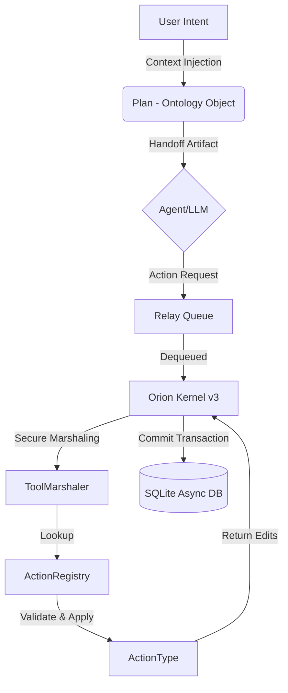

# ODA V3.5 Architecture Deep Dive: Request for Comment (RFC)

**Date:** 2025-12-27  
**Target Audience:** Senior Systems Architect / Lead Developer  
**Status:** ✅ **E2E Verified** (Workflow Integrity Confirmed)  
**Kernel:** Orion V3.5 (Async/AIP-Logic)

---

## 1. Executive Summary
The **Orion Orchestrator** has successfully transitioned to **ODA v3.5 (Ontology-Driven Architecture)**. This release solidifies the separation between **Cognitive Planning** (LLM) and **Deterministic Execution** (Runtime).

The system currently passes the full workflow E2E test (`scripts/tests/test_workflow_e2e.py`), validating the chain from **Plan Generation** → **Handoff** → **Action Execution** → **Persistence**.

We are requesting a Deep Dive review on the **Persistence Strategy** and the **Action-Kernel Interface**.

---

## 2. System Topology (The Workflow)

The architecture follows a strict unidirectional data flow:



### Key Invariants
1.  **Ontology Supremacy**: All state is defined in `scripts/ontology/`.
2.  **Stateless Actions**: `ActionType` classes are functional. They return *intent* (`EditOperation`), they do not write to the DB directly.
3.  **Kernel as Actuator**: The `OrionRuntime` (Kernel) is the only component with write-access to the Database for Action results.

---

## 3. Component Deep Dive

### 3.1 Persistence Layer (Async SQLAlchemy 2.0)
*   **Location**: `scripts/ontology/storage/`
*   **Model**: `models.py`
*   **Core**: `AsyncOntologyObject`

We use **SQLAlchemy 2.0 Async ORM** with `aiosqlite` in **WAL Mode**.
*   **Optimistic Locking**: Enforced via `version` column. Updates fail if version mismatches.
*   **Audit Fields**: `created_at`, `updated_at`, `created_by`, `updated_by` are mandatory.
*   **Schema Separation**: Pydantic models (in `objects/`) are for Domain/API. SQLAlchemy models (in `storage/models.py`) are for Persistence.
    *   *Recent Fix*: Added `TaskModel` and `AgentModel` to `models.py` to resolve missing table errors.

### 3.2 The Action System (Governance)
*   **Location**: `scripts/ontology/actions.py`
*   **Registry**: `scripts/ontology/objects/task_actions.py`

Actions are the "write" atoms of the system.
*   **Structure**: Subclass `ActionType[T]`.
*   **Validation**: Declarative `SubmissionCriterion` (e.g., `RequiredField`, `FutureDueDate`).
*   **Execution**: `apply_edits()` returns a tuple `(Object, List[EditOperation])`.
*   **Discovery**: Decorator-based registration (`@register_action`).
    *   *Integration Note*: The consumer MUST import the module (e.g., `import objects.task_actions`) for the registry to populate.

### 3.3 The Runtime Kernel (Execution)
*   **Location**: `scripts/runtime/`
*   **Components**: `kernel.py`, `marshaler.py`

The Kernel operates as an infinite async loop (Active Poller).
1.  **Polls** `RelayQueue` for `ActionRequest`.
2.  **Marshals** execution via `ToolMarshaler`.
    *   *Security*: Marshaler ensures `ActionContext` is valid (Correlation ID, Actor).
3.  **Persists** results.
    *   *Current Implementation*: The Kernel takes the `EditOperation` from the Action result and constructs the SQL `INSERT`/`UPDATE` manually (or via ORM add). **This is a key area for review.**

---

## 4. Current Implementation Status (v3.5)

### ✅ What Works
*   **Full Async Pipeline**: From `test_workflow_e2e.py` start to DB commit.
*   **Action Registry**: Correctly resolves string names (`create_task`) to Python classes.
*   **Integrity Constraints**: `NOT NULL` constraints on `tags` and `status` are enforced and handled.

### ⚠️ Areas for Feedback (The "Deep Dive" Request)

1.  **Kernel Persistence Pattern**:
    Currently, the Test (simulation of Kernel) performs manual SQL insertion for `EditOperation`.
    *   *Constructive Feedback Needed*: Should we implement a generic "EditOperation to ORM Mapper" in `ProposalRepository` to avoid manual SQL in the Kernel?

2.  **Domain vs. Persistence Duality**:
    We maintain two sets of classes: `Task` (Pydantic) and `TaskModel` (SQLAlchemy).
    *   *Constructive Feedback Needed*: Is this separation providing enough value (decoupling) to justify the maintenance cost of keeping them in sync (e.g., ensuring `priority` Enum matches)?

3.  **Handoff Protocol**:
    The Handoff artifact (`.md` file) serves as the "Prompt" for the Agent.
    *   *Constructive Feedback Needed*: Is the current Markdown format sufficient for complex Agentic instructions, or should we move to a structured JSON schema for Handoffs?

---

## 5. How to Verify (Walkthrough)

To verify the system state before providing feedback:

1.  **Activate Environment**:
    ```bash
    source /home/palantir/.venv/bin/activate
    ```

2.  **Run the E2E Integrity Test**:
    ```bash
    python /home/palantir/orion-orchestrator-v2/scripts/tests/test_workflow_e2e.py
    ```
    *Expect output: `✅ Action Execution SUCCESS` and `✅ Data Persisted`.*

3.  **Inspect the DB Schema**:
    ```bash
    sqlite3 /home/palantir/orion-orchestrator-v2/data/ontology.db ".schema tasks"
    ```
