# Orion ODA v3.0 E2E Workflow

This document illustrates the complete End-to-End Workflow of the new Hybrid Semantic OS.

## 🔄 Cognitive Data Flow

```mermaid
sequenceDiagram
    participant User
    participant Router as 🧠 HybridRouter
    participant Local as 🤖 Ollama (Local)
    participant Relay as 📨 RelayQueue (SQLite)
    participant Kernel as ⚙️ V3 Kernel
    participant Ontology as 📦 Ontology (DB)
    participant Admin as 👩‍💻 Human Admin
    participant Ext as 🌐 External App

    User->>Router: "Process this Request"
    
    rect rgb(200, 255, 200)
    Note over Router,Local: Phase 2: Intelligence
    Router->>Router: Check Complexity
    alt Simple Task
        Router->>Local: Generate(Prompt)
        Local-->>User: Fast Response (JSON)
    else Complex / Critical Task
        Router->>Relay: Enqueue(Task)
        Relay-->>User: "Task Queued (ID: xxx)"
    end
    end

    rect rgb(220, 220, 255)
    Note over Relay,Kernel: Phase 3: Relay & Governance
    loop Every 1s
        Kernel->>Relay: Dequeue()
        Relay-->>Kernel: Task Payload
    end
    
    Kernel->>Ontology: Create Object (Task)
    Kernel->>Ontology: Create Proposal (Action: Deploy)
    end

    rect rgb(255, 220, 220)
    Note over Ontology,Admin: Phase 4: HITL & Action
    Admin->>Ontology: Review Proposal
    Admin->>Ontology: Set Status = "Approved"
    
    Kernel->>Ontology: Watch(Proposal.status == 'Approved')
    Kernel->>Kernel: Validate SubmissionCriteria
    Kernel->>Ontology: Apply Edits (Commit)
    Kernel->>Ext: Trigger SideEffect (Webhook/Notify)
    end
```

## 📝 Workflow Details

### 1. Ingestion & Routing (Logic Layer)
- **HybridRouter**: Analyzes the request complexity.
- **Fast Path**: Direct call to `OllamaClient` for simple reasoning or text generation.
- **Governed Path**: Critical actions are serialized and sent to the `RelayQueue`.

### 2. Semantic Processing (Kernel Layer)
- **V3 Kernel**: The main event loop. It polls the `RelayQueue` (WAL Mode SQLite) for high-reliability message processing.
- **Object Creation**: Converts raw text prompts into structured `Task` objects in the Ontology.

### 3. Human-in-the-Loop (Governance Layer)
- **Proposal System**: Significant changes (e.g., "Delete Database", "Deploy Prod") do not execute immediately.
- **Drafting**: The Kernel creates a `Proposal` object with `status='pending'`.
- **Review**: A human (or high-level AI) acts as a `Reviewer` and approves the proposal.

### 4. Execution & Effects (Action Layer)
- **Validation**: The `ActionType` runs `SubmissionCriteria` (e.g., Check permissions, lint code).
- **Commit**: The `Ontology` is updated transactionally.
- **Side Effects**: Post-commit, the system triggers `NotificationEffect` or `WebhookEffect` to alert external systems.
